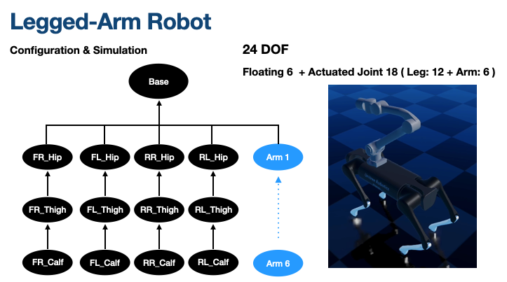

# Raisim Example
This is a Raisim example demonstrating **convex-MPC (Model Predictive Control)** for quadruped robots and **HWBC(Hierarchical Whole-Body Control)** for legged mobile manipulators.

## Dependencies
This project uses the following external libraries:

- [Raisim](https://raisim.com/) - Physics simulation library
- [Eigen](https://eigen.tuxfamily.org/dox/) - Linear algebra library
- [OsqpEigen](https://github.com/robotology/osqp-eigen) - Quadratic programming solver

## How to Use
1. **Install Raisim**  
   Follow the instructions on the [Raisim official website](https://raisim.com/) to install the library.

2. **Build the Project**  
   Run the following commands to build the project:

   ```bash
   mkdir build && cd build
   cmake .. 
   make

## Demonstrations

### Convex-MPC

<p align="center">
  
  
</p>

### HWBC
<p align="center">
  
  
</p>